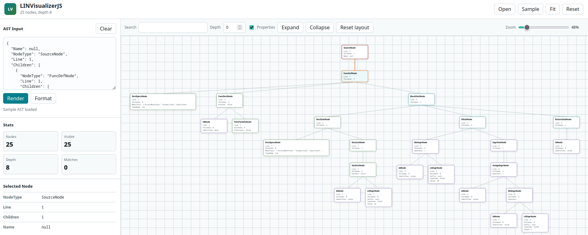

# LINVisualizerJS



Interactive browser visualizer for LINVAST AST JSON output.

## Usage

Run the visualizer:
```sh
./run
```

Open a LINVAST JSON file or paste the JSON into the input panel and render it.

## Development

Build the static app:

```sh
./build
```

Serve an existing build:

```sh
./run --no-build --port 5174
```

The project has no runtime package dependencies. `./build` validates JavaScript syntax, validates the sample AST JSON, and writes `dist/`.

## Features

- LINVAST JSON file loading and pasted JSON input.
- SVG tree rendering with pan, zoom, fit, reset, and node selection.
- Selected-node branch highlighting, draggable node positions, and layout reset.
- Node property toggling, max-depth cutoffs, branch collapse/expand, and search highlighting.
- Node counts, visible counts, tree depth, match counts, and selected-node details.
